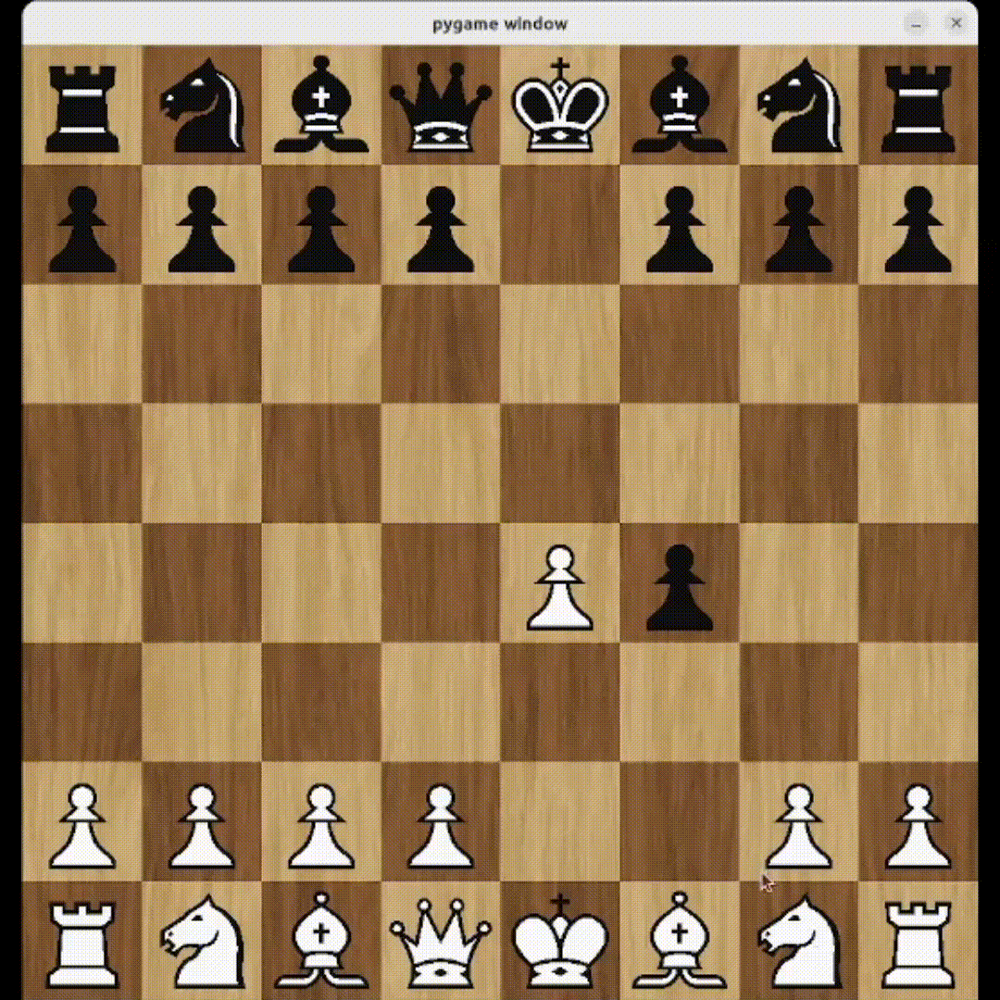

# Chess Game Project

## Description

Welcome to my Chess Game project! This project is a fully functioning chess game built to replicate the classic game of strategy, intellect, and skill. The game follows the standard rules of chess, allowing two players to compete on an 8x8 board, moving pieces like pawns, rooks, knights, bishops, queens, and kings. The game tracks legal moves, check, checkmate, and stalemates, providing a premium experience for every that wants to play chess online.

## Technologies Used

- **Programming Language**: Python
- **Game Logic**: Custom implementation of chess rules
- **Animations**: Pygame
- **GUI**: Pygame_GUI
- **Version Control**: Git

## Motivation

I am always trying to improve at every aspect of life, but mostly at programming. The university courses I have taken has thought me much, but I had never worked on such a complex project as this one before. I wanted to test my algorithmic thinking and OOP design skills with a project and my passion for both programming and chess brought me here. Chess, being a game with a rich history and deep complexity, was the perfect choice to challenge myself.

## Hurdles

I faced many hurdles while trying to finish the project. I had to refactor my code several times, changing some things entirely, while improving others. I was constantly trying to stick to DRY principles and writing elegant and clean code. These two things helped immensely and I could reduce the hurdles along the way, being able to go back to code I have written days before and easily catch on it was a pleasant experience and helped me a lot. Still making the En Passant and castle moves, work as they should was still a challenge, but I got through it.

## Visualizations

### Pawn

### En Passant

### Castle
White queen side castle:

Black king side castle:

Can't castle sometimes:

As chess players know, you can't castle when you are in check, either king or rook has moved, or the square next to the king is attacked. Every one of these features is of course implemented! Here I show just one of those features and everyone that wants to see from themselves can clone the repo and play!

### Bishop

### Knight

## How to Play

* Clone the repo.
* Run the Server.py file.
* Change the port from the server/constants.py module if it is in use.
* Run main.py to start client.
* Run main.py again on the same or different machine.
* Play.

## Not good enough
In the past I have been scared of using any code as portfolio and showing it to people. Fear that my code is not good enough is always present, but I am channeling these emotions into trying to get better and not be scared of showing my work. I know it is not perfect. The GUI manager and the networking part is probably the weakest link in the chain of this project, but they are "good enough". I will improve them, when I have time, but for now it will stay like this.

## Ways to extend
A project can never be finished. Chess apps have many, many features. I would like to extend the project into the following directions:
* Beautiful GUI.
* Login system with database.
* ELO system.
* Matchmaking system.
* Ask enemy to undo move.
* Chat between players.
* Showing captured piece.
* Game over, checkmate, stalemate page.
* Surrender.

Some of these, for example game over, checkmate, stalemate pages, undo moves and others are low hanging fruits to extends. Why? Because the logic is already built into the game module, and the only piece missing is the GUI and networking part.

